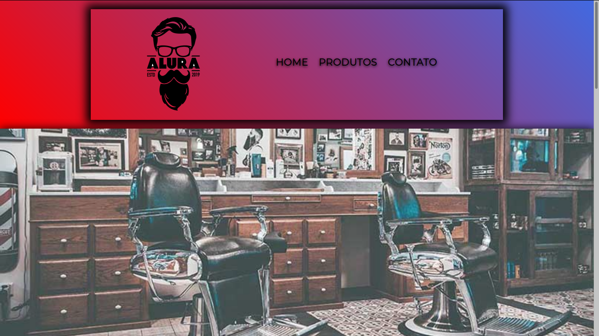

# Barbearia-Alura

Projeto desenvolvido no curso HTML5 e CSS3 da Alura Cursos.

# Objetivo 

O projeto foi desenvolvido com o objetivo de iniciar os estudos na área de Front-end, criando uma base de HTML5 e CSS3.

# Como rodar

Para executar o projeto basta seguir os seguintes passos:

- Clonar o repositório;
- executar o arquivo ``` index.html ```, que é a página inicial do projeto.

O projeto contém 3 páginas, sendo elas acessíveis por qualquer página do mesmo.

A tela inicial tem essa cara:

<h1 align="center">
    
</h1>

Aproveite o código!